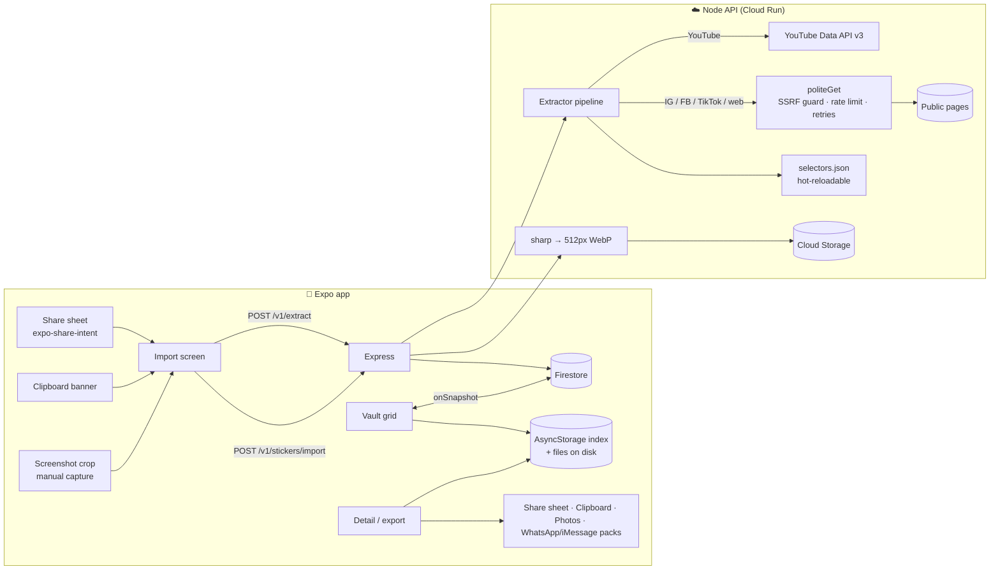

# Architecture

## Flow

1. **Capture.** A user shares a post from Instagram, TikTok, etc. to Pluck (iOS share extension or Android `ACTION_SEND`), or copies a link and taps the in-app banner. If they share a screenshot instead, it goes straight to manual import.
2. **Extract.** `POST /v1/extract {url}` returns ranked *candidates* and saves nothing. The pipeline:
   - canonicalises the URL (strips `igsh`, `fbclid`, `utm_*` and similar) so caching and in-flight de-duplication work
   - **YouTube** uses the official Data API (`commentThreads.list`)
   - **everything else** fetches public HTML through `politeGet` and runs three independent passes (`backend/src/extractors/heuristics.js`):
     1. CSS selectors for images inside comment containers (precise but brittle)
     2. URLs found inside embedded `<script>` JSON (survives redesigns)
     3. `og:image` as a low-ranked "post media" fallback
   - scores each candidate (inside a comment, sticker CDN path, GIF/WebP, square, `alt="sticker"`) and rejects avatars, emoji sprites and tracking pixels
3. **Pick and save.** The user taps the candidates they want. `POST /v1/stickers/import` downloads each one with the same SSRF guard, normalises it with sharp to a **512×512 transparent WebP** (animation kept, under WhatsApp's size caps) plus a 192px thumbnail, and stores it at `users/{uid}/stickers/{sha256}`. The content hash is the doc id, so saving the same sticker twice is a no-op.
4. **Vault.** The app paints from a local AsyncStorage index instantly, subscribes to Firestore for cross-device sync, and downloads every image to disk so export works offline.
5. **Export.** Uses the local file: share sheet, copy to clipboard, save to Photos, or WhatsApp/iMessage packs through a native bridge. See [EXPORT.md](EXPORT.md).

## Data model

`users/{uid}/stickers/{sha256}`

| field | notes |
|---|---|
| `url`, `thumbUrl` | Storage download URLs (content-addressed, cached for 1 year) |
| `storagePath` | `users/{uid}/stickers/{sha}.webp` |
| `sourcePlatform` | `instagram · facebook · tiktok · youtube · x · reddit · web · manual` |
| `sourceUrl`, `originalUrl` | post link and the original CDN image URL |
| `tags[]`, `favorite` | the only fields clients may edit (enforced in `firebase/firestore.rules`) |
| `animated`, `bytes`, `whatsappCompatible`, `originalFormat/Width/Height` | set by the backend |
| `createdAt`, `updatedAt` | server timestamps |

Composite indexes for "by platform" and "by tag", newest first, are in `firebase/firestore.indexes.json`.

## Why share sheet + clipboard, not a floating overlay

- A floating bubble (`SYSTEM_ALERT_WINDOW`) is **Android only**. iOS has no equivalent.
- On Android it needs a scary permission, and it can only capture pixels through MediaProjection, which shows a persistent "recording" notice.
- The share sheet works on both platforms, needs no permissions, and hands us the canonical URL.
- Manual capture (screenshot → crop in the picker) covers what an overlay would, without the permission.

An Android overlay could be added later as a native module that opens the same Import screen.

## Deploying

- **Backend:** `cd backend && npm ci && npm start`. It's stateless apart from in-memory caches, so it fits Cloud Run. Before running more than one instance, move the cache, in-flight map and rate-limit buckets to Redis so limits are global.
- **Firebase:** `firebase deploy --only firestore,storage`.
- **App:** needs a dev build (`npx expo run:ios|android` or EAS), because the share extension is native. Expo Go can't receive share intents.
